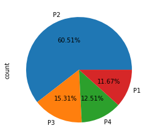

# Credit Risk Modeling [Application](https://huggingface.co/spaces/ashish-001/Credit_risk_modeling)
A machine learning model to segregate customers based on their previous financial information for loan approval. The model determines the risk of lending money to a customer by assigning it to a specific class.

## Model result on test dataset

## Class distribution in the dataset

## Application Demo
